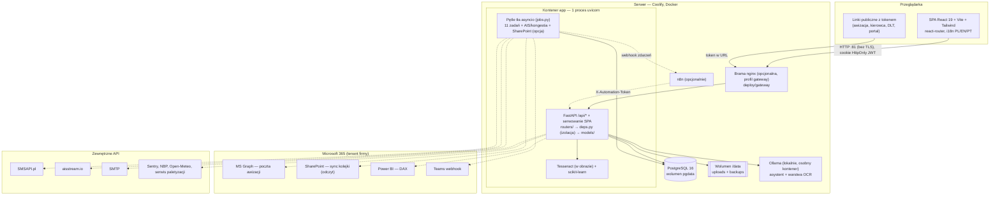
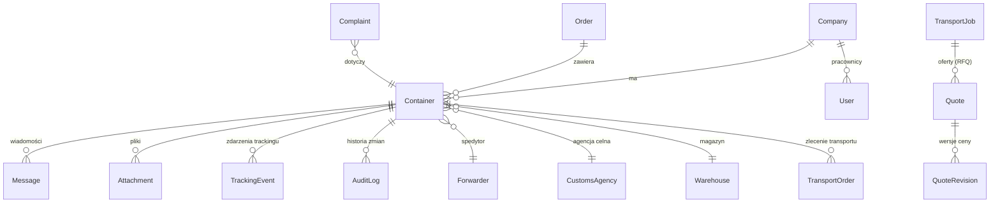
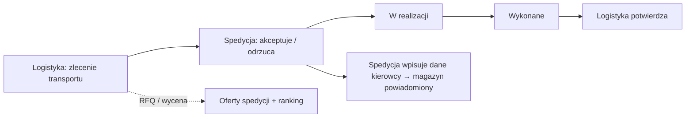
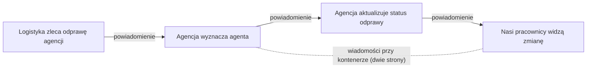
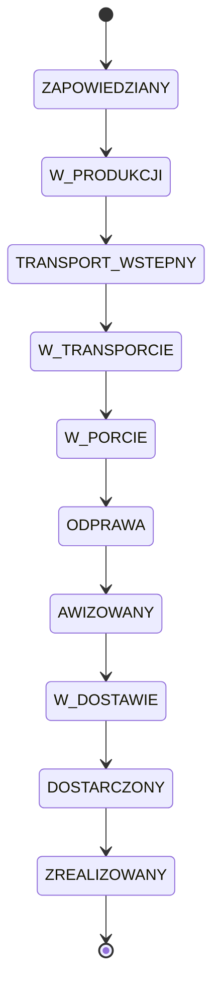
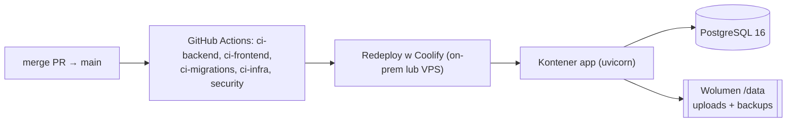

# Architektura aplikacji „Kolejka" (TIMPORYE)

Dokument opisuje **jak zbudowana jest aplikacja i jak działa** — od stosu technologicznego,
przez model danych i role, po przepływy procesowe, bezpieczeństwo i wdrożenie.

> **Stan na 2026-09-28** (zweryfikowany z repo).

---

## 1. Czym jest aplikacja

„Kolejka" to system zarządzania **kolejką kontenerów** dla firmy logistycznej i jej spółek
(Acme, Borealis, Cobalt Sport, Iberia) oraz partnerów zewnętrznych (spedycje, agencje celne,
magazyn zewnętrzny DLT). Prowadzi kontener od zapowiedzi, przez transport morski, port, odprawę
celną, awizację, aż po rozładunek w magazynie — z powiadomieniami, wiadomościami i pełną historią.

## 2. Widok wysokopoziomowy



Linie przerywane = integracje włączane konfiguracją (puste zmienne = funkcja wyłączona).
Całość aplikacji to **jeden obraz** (`Dockerfile.coolify`): backend serwuje też zbudowany frontend
(z fallbackiem SPA), start = `alembic upgrade head && uvicorn`. Jedna instancja z pętlami tła
(`RUN_BACKGROUND_JOBS`; brak blokady rozproszonej — druga instancja musi mieć `false`).

## 3. Stos technologiczny

| Warstwa | Technologia |
|---|---|
| Frontend | React 19, react-router-dom 7, Vite 8, Tailwind v4, TypeScript (build w etapie Dockera) |
| Backend | Python 3.12, FastAPI, Uvicorn, SQLAlchemy 2.0, Pydantic v2 |
| Baza | PostgreSQL 16 (prod, kontener `db` w `docker-compose.coolify.yml`) / SQLite (dev, testy), migracje **Alembic** |
| Auth | JWT (PyJWT) w cookie HttpOnly, hasła **bcrypt**, 2FA |
| OCR / AI | Tesseract (pol+eng) w obrazie, scikit-learn; LLM tylko lokalnie przez Ollamę (`llm.py`) |
| Pliki | Excel — openpyxl; załączniki, faktury PDF, modele ML i kopie na wolumenie `/data` |
| CI/CD | GitHub Actions (2 runnery self-hosted + GitHub-hosted); wdrożenie: ręczny Redeploy w Coolify |

### Integracje (stan z kodu)

| Integracja | Moduł | Tryb |
|---|---|---|
| MS Graph (M365) / SMTP — poczta awizacji | `mailer.py` (`MAIL_BACKEND=graph\|smtp\|console`) | konfiguracja env |
| Szkic maila `.eml` do Outlooka | `eml.py` | zawsze (użytkownik wysyła ze swojego Outlooka) |
| SMTP — zaproszenia, reset hasła, powiadomienia | `notifications.py`, `config.py` (`SMTP_*`, `INVITE_SMTP_*`) | konfiguracja env |
| SharePoint (Graph, `Sites.Selected` read) — sync kolejki | `sharepoint.py`, `docs/SHAREPOINT-SYNC.md` | **domyślnie ręcznie**; pętla tylko przy `SHAREPOINT_AUTO_SYNC` |
| SMSAPI.pl — SMS do kierowców | `sms.py` (`SMS_PROVIDER=smsapi\|mock\|off`) | konfiguracja env |
| aisstream.io — pozycje statków (AIS) | `tracking/ais.py`, `tracking/congestion.py` | gdy ustawiony `AISSTREAM_API_KEY` |
| Ollama (lokalny LLM) — asystent wiedzy, warstwa OCR | `llm.py`, `routers/assistant.py`, `invoices/` | gdy ustawiony `OLLAMA_URL`; dane nie wychodzą do chmury |
| n8n — automatyzacje | `config.py` (`AUTOMATION_*`), `docs/N8N.md`, `deploy/n8n/` | opcjonalnie; token `X-Automation-Token` |
| Power BI (DAX, dane SAP BW) | `powerbi.py` | provider off/mock/real |
| Teams — karty na webhook kanału | `teams.py` | gdy ustawiony `TEAMS_WEBHOOK_URL` |
| Sentry — błędy | `main.py` (`init_sentry`) | gdy ustawiony `SENTRY_DSN` |
| NBP (kursy), Open-Meteo (pogoda), serwis paletyzacji | `nbp.py`, `tracking/weather.py`, `packing/container.py` | wywołania na żądanie |

Tracking kontenerów przez zewnętrznego providera (SafeCube) **usunięto** (`tracking/service.py`) —
pozycje statków daje wyłącznie AIS, oś zdarzeń to zdarzenia w bazie + ręczne statusy.

## 4. Struktura repozytorium

```
backend/
  app/
    main.py            # aplikacja FastAPI, middleware, lifespan (start pętli tła), serwowanie SPA
    config.py          # ustawienia (env, pydantic-settings)
    models/            # modele SQLAlchemy (pakiet: container, transport, avizo, invoices, …; enums.py = statusy i role)
    schemas/           # Pydantic (walidacja wejścia/wyjścia API)
    security.py        # JWT, bcrypt, rate-limit logowania, get_current_user
    deps.py            # izolacja per-zasób (scope_containers, check_container_access, _enforce_scope, get_scoped)
    jobs.py            # tabela zadań tła + runner
    notifications*.py  # powiadomienia in-app/e-mail + alerty i digesty
    audit.py           # historia zmian (AuditLog)
    invoices/ packing/ tracking/ analytics/ importers/   # moduły domenowe
    routers/           # endpointy REST (~70 plików, obszary domenowe)
  migrations/          # Alembic
  scripts/             # backup.sh, restore.sh, verify_backup.py, seed_demo.py, …
  tests/               # pytest
frontend/
  src/pages/           # widoki
  src/App.tsx          # routing + nawigacja + gating ról
  src/i18n/            # tłumaczenia PL/EN/PT (nowe klucze: i18n/features/<funkcja>.ts)
deploy/                # brama nginx (gateway/), n8n
scripts/               # check_file_lengths.py, smoke.sh
docs/                  # dokumentacja
Dockerfile.coolify     # obraz wdrożeniowy
docker-compose.coolify.yml  # db (postgres 16) + app + opcjonalna brama
.github/workflows/     # CI, automerge, skany bezpieczeństwa, e2e, deploy (ręczny)
```

**Routery backendu** — główne obszary: `auth`, `admin`, `containers*` (kolejka), `imports*`,
`dictionaries*`, `forwarding*` (spedycja), `customs` (agencja celna), `quotes*` (wyceny/RFQ),
`avizo*` (awizacja), `complaints*` (reklamacje), `tracking`, `invoices*` (faktury, OCR),
`purchasing`/`purchase_orders` (zakupy), `customer_orders` (Specjalna troska), `dlt`, `pallets`,
`driver`, `portal`, `share`, `assistant`, `knowledge`, `notifications`, `system`, `logs`.

## 5. Model danych — główne encje



- **Container (kontener)** — centralna encja: numer ISO 6346, status, odprawa celna, dane kierowcy,
  ETA, awizacja, tracking. Do niej podpięte są wiadomości, pliki, historia i zdarzenia.
- **Order (zlecenie)** — grupuje kontenery jednego zamówienia (Borealis/Cobalt).
- **Forwarder / CustomsAgency / Warehouse** — partnerzy: spedycja, agencja celna, magazyn.
- **TransportJob + Quote + QuoteRevision** — zapytania ofertowe (RFQ) do spedycji i historia wycen.
- **Complaint** — reklamacje (RTV/formalne) z problemami i zdjęciami.
- **AuditLog** — każda istotna zmiana pola (kto, kiedy, ze/na jaką wartość).

## 6. Role i separacja dostępu

Aplikacja jest **wielospółkowa (multi-tenant)** i rozróżnia partnerów wewnętrznych od zewnętrznych.

| Rola | Kto | Zakres widoczności |
|---|---|---|
| `admin` | administrator systemu | wszystko + panel administracyjny |
| `logistics` | logistyka spółki | kontenery swojej spółki (lub wszystkich, gdy „view all") |
| `warehouse` | magazyn (np. zewn. DLT) | tylko kontenery swojego magazynu; dane handlowe ukryte |
| `forwarder` | spedycja (zewn.) | tylko kontenery jej zlecone; brak danych konkurencji |
| `customs` | agencja celna (zewn.) | tylko kontenery, których odprawę jej zlecono; dane handlowe/PII ukryte |
| `purchasing` | dział zakupów (wewn.) | kontenery swojej spółki; bez dostępu do Wycen (koszty) |
| `sales` | sprzedaż (wewn.) | tylko odczyt kolejki/kalendarza/śledzenia/Specjalnej troski, bez kosztów; poza `READER_ROLES` (fail-closed) |

**7 ról** — enum `Role` w `backend/app/models/enums.py`.

Separacja jest egzekwowana **centralnie i fail-closed** w `deps.py`:
`scope_containers()` / `scope_transport_orders()` (filtr list), `check_container_access()` (pojedynczy
kontener) oraz `_enforce_scope()` / `get_scoped()` (pozostałe zasoby powiązane z kontenerem).
Brak przypisania (np. spedytor bez firmy) = `403`, nigdy „widzi wszystko". Dane handlowe i PII
są dodatkowo maskowane dla partnerów zewnętrznych (`_WAREHOUSE_HIDDEN`, `_CUSTOMS_HIDDEN`) — także
w historii audytu i w endpointach pozycji/SENT.

## 7. Kluczowe przepływy procesowe

**Import kontenerów (tylko admin)** — kontenery dodaje się wyłącznie przez plik Excel
(zakładki per spółka), schowany w panelu administratora. Import mapuje nagłówki na pola,
waliduje numery ISO 6346, dopasowuje spedytora i agencję celną do rejestru.

**Spedycja (moduł `forwarding`)**


**Agencja celna (moduł `customs`)** — obieg dwustronny:

Dodatkowo alert „odprawa się przeciąga" (status ZLECONA/REWIZJA dłużej niż próg dni).

**Awizacja (`avizo`)** — prośba o okno rozładunku do magazynu; publiczny formularz z tokenem
czasowym (bez logowania). **Reklamacje (`complaints`)** — zgłoszenia z typami problemów i zdjęciami.
**Śledzenie (`tracking`)** — pozycje statków z AIS, mapa, oś czasu kontenera, kongestia portów.

## 8. Cykl życia kontenera


Kolejność = `ContainerStatus` w `models/enums.py`. Statusy zmienia człowiek (logistyka; magazyn tylko
→DOSTARCZONY/ZREALIZOWANY) — automatu zmiany statusu z trackingu już nie ma (provider usunięty).
Równolegle prowadzony jest **status odprawy** (`CustomsStatus`): `BRAK`, `DOKUMENTY_KOMPLETNE`, `ZLECONA →
DRAFT_WYSLANY → DRAFT_POTWIERDZONY → ODPRAWIONY → ROZLICZONY`, `REWIZJA`; oraz alerty demurrage
(zbliżający się koniec dni wolnych).

## 9. Bezpieczeństwo

- **Uwierzytelnianie**: JWT w cookie `HttpOnly` + `SameSite=Lax`, flaga `Secure` sterowana `SECURE_COOKIES`
  (w produkcji `true` — HTTPS wymagany; wyjątek tylko jawnym `ALLOW_INSECURE_HTTP`); odświeżanie
  tokenów; `session_version` unieważnia wszystkie sesje. Hasła **bcrypt**; konta z zaproszenia
  wymuszają zmianę hasła tymczasowego.
- **Autoryzacja**: separacja ról fail-closed (patrz §6) + test-strażnik wymuszający zadeklarowanie
  zachowania dla każdej nowej roli.
- **Ochrona danych**: maskowanie danych handlowych/PII dla partnerów zewnętrznych (kontener,
  historia audytu, pozycje, SENT).
- **Warstwa web**: nagłówki CSP / X-Frame-Options / nosniff (HSTS działa dopiero za HTTPS); CORS z whitelisty; globalny
  rate-limit API i limit prób logowania; pobieranie plików jako `application/octet-stream`
  (bez sniffingu), nazwy plików bez path-traversal.
- **CI**: Bandit (SAST), pip-audit / npm audit, gitleaks (sekrety), Trivy — szczegóły i co blokuje
  merge: `SECURITY.md` (CodeQL nie jest skonfigurowany). Sekrety w
  GitHub Secrets / panel Coolify — nigdy w kodzie.

## 10. Zadania w tle (asyncio)

Tabela zadań w `backend/app/jobs.py` (`build_jobs`), start w `lifespan` (`main.py`). Każde zadanie:
pierwszy przebieg zaraz po starcie, potem co interwał; każda funkcja we własnym `try` i sesji DB,
przebiegi zapisywane w dzienniku (`applog.record_job`, panel admina). Wyłącznik: `RUN_BACKGROUND_JOBS=false`.

| Zadanie | Interwał | Co robi |
|---|---|---|
| `demurrage` | 6 h | alerty zbliżającego się końca dni wolnych |
| `customs_delay` | 6 h | przeciągające się odprawy, braki dokumentów, prognoza przeciążenia, alerty trackingu (AIS), stęchłe importy |
| `sms_reminders` | 15 min | auto-SMS kierowcom jutrzejszych dostaw (godzina z panelu admina) |
| `complaints` | 6 h | przypomnienia reklamacji, przedawnienia, auto-szkice |
| `pallet_urgent` | `PALLET_ALERT_INTERVAL_HOURS` | pilne palety (Power BI) |
| `weekly_digest` | 20 min (okno pon. 6–7 UTC) | tygodniowy digest |
| `verify_backup` | 6 h (działa raz w dniu `VERIFY_BACKUP_WEEKDAY`) | restore ostatniej kopii do tymczasowej bazy |
| `daily_digest` | 20 min (okno `DIGEST_HOUR`) | dzienny digest |
| `avizo_maintenance` | 24 h | wygaszanie linków awizacji, zamykanie, anonimizacja danych kierowców |
| `monitor_sample` | 60 s | próbka CPU/RAM do panelu admina |
| `applog_retention` | 24 h | retencja 30 dni dziennika serwera |
| `sharepoint_queue` *(opcja)* | `SHAREPOINT_QUEUE_INTERVAL_MINUTES` | tylko przy komplecie `SHAREPOINT_*` **i** `SHAREPOINT_AUTO_SYNC`; domyślnie sync kolejki jest **ręczny** |
| `congestion` + `ais_loop` *(opcja)* | `TRACKING_INTERVAL_HOURS` / websocket | tylko przy `AISSTREAM_API_KEY`: pozycje statków i kongestia portów |

Dodatkowo `applog_loop` (zrzut bufora dziennika do bazy) biega na każdej instancji.
Powiadomienia trafiają in-app, e-mailem (SMTP), opcjonalnie na Teams i do n8n (webhook zdarzeń).

## 11. Infrastruktura, wdrożenie i CI/CD



| Element | Opis | Źródło |
|---|---|---|
| Hosting | Coolify + Docker Compose (`docker-compose.coolify.yml`, `Dockerfile.coolify`) | `docs/DEPLOY_COOLIFY.md` |
| Wdrożenie | Redeploy w Coolify; migracje przy starcie (`alembic upgrade head`); smoke `scripts/smoke.sh` | `scripts/smoke.sh` |
| CI | testy backendu i frontendu, migracje na Postgresie, lint infrastruktury, gitleaks/Bandit | `.github/workflows/` |
| Kopie zapasowe | `backend/scripts/backup.sh` (zadanie cykliczne w Coolify): baza + załączniki, szyfrowanie `age`, weryfikacja restore (`verify_backup`) | `docs/BACKUPY.md` |
| Brama nginx | opcjonalna (profil `gateway` w compose) | `deploy/gateway` |
| Ollama / n8n | opcjonalne (`OLLAMA_URL`, `AUTOMATION_*`) | `docs/N8N.md` |
| Poczta | `MAIL_BACKEND` (graph/smtp/console); szkice `.eml` do Outlooka zawsze dostępne | `docs/ZMIENNE-SRODOWISKOWE.md` |
| Sentry | opcjonalnie przez `SENTRY_DSN` | `docs/ZMIENNE-SRODOWISKOWE.md` |

- Konfiguracja wyłącznie przez zmienne środowiskowe w Coolify (m.in. `DATABASE_URL`, `SECRET_KEY`,
  `SECURE_COOKIES`, `PUBLIC_BASE_URL`, `ALLOWED_HOSTS`, `MAIL_BACKEND`, `SMS_PROVIDER`, `OLLAMA_URL`,
  `AISSTREAM_API_KEY`, `SENTRY_DSN`); sekrety nigdy w repo.
- W dev (SQLite) schemat zakłada `db_bootstrap` przy starcie; na produkcji (`ENVIRONMENT=production`) bootstrap pomija DDL — schemat wyłącznie z migracji Alembic.

---

### Skrót jednym zdaniem
Monolityczna aplikacja FastAPI (serwująca też SPA React) na PostgreSQL, wdrażana jednym obrazem na
Coolify (on-prem lub VPS), z wielospółkową separacją danych i dedykowanymi modułami dla spedycji i
agencji celnej — z naciskiem na przejrzystość procesu, powiadomienia i bezpieczeństwo danych.
