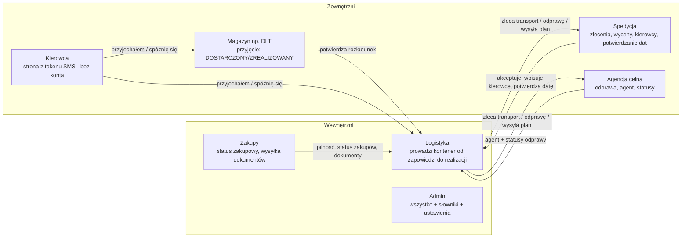
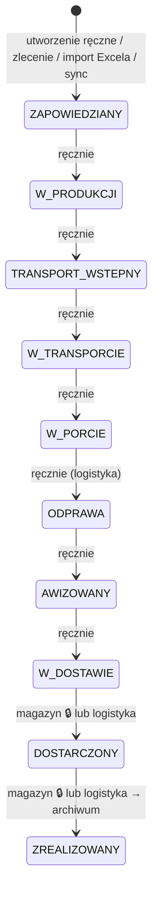
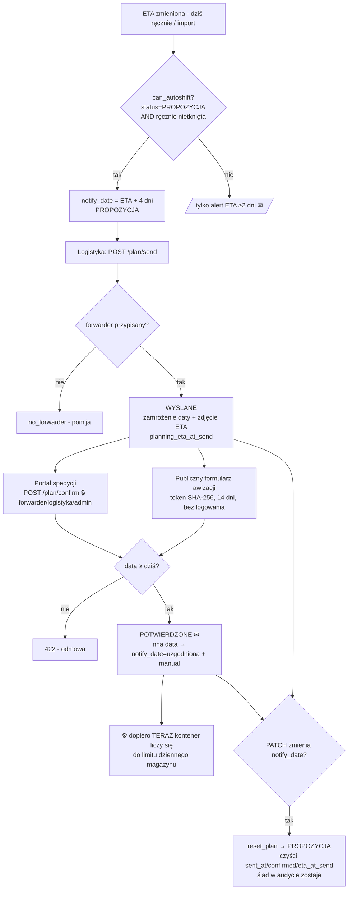
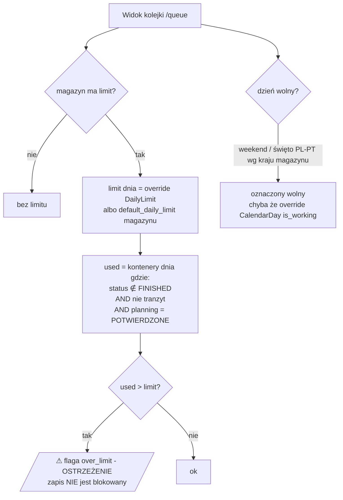
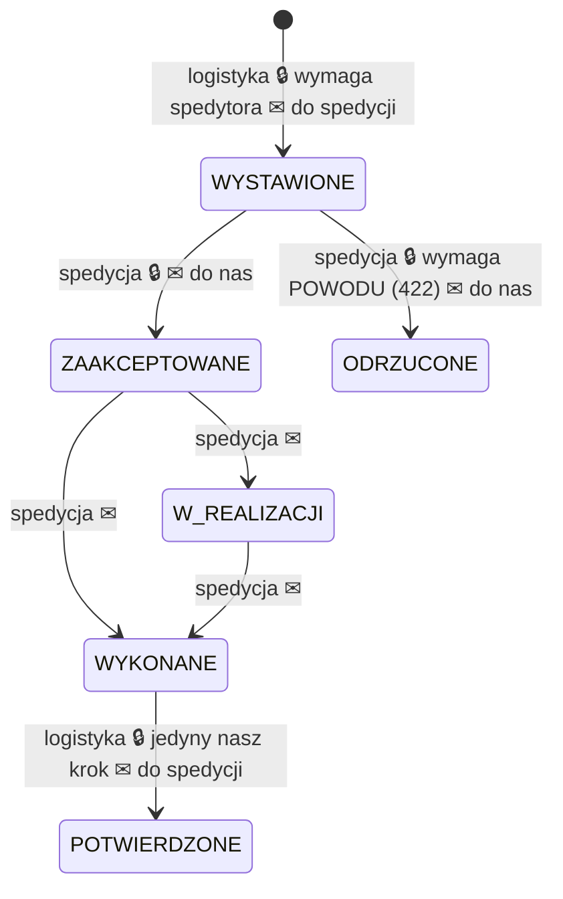
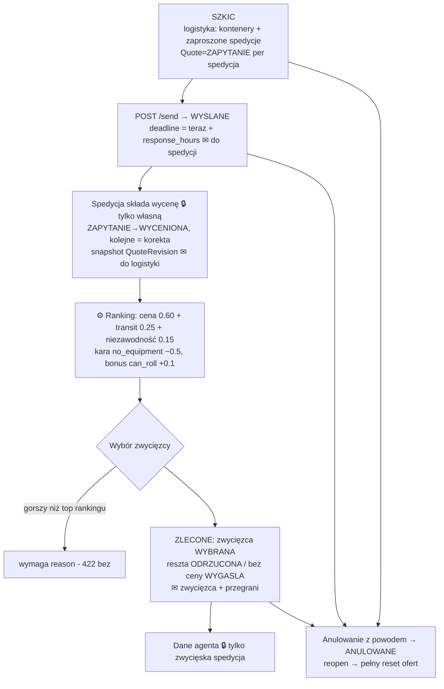
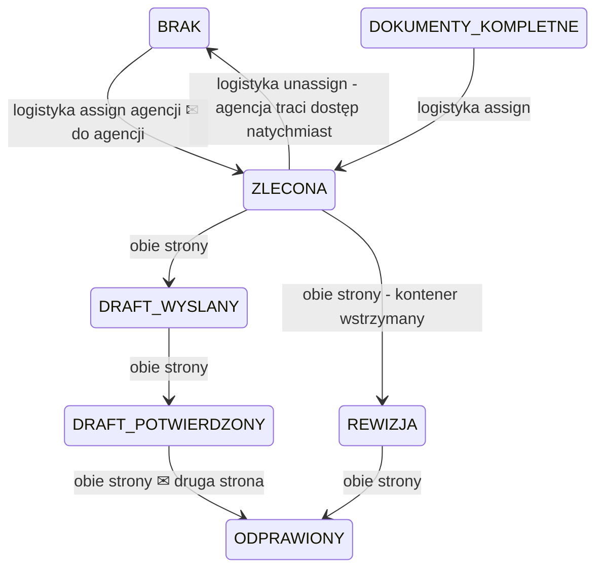
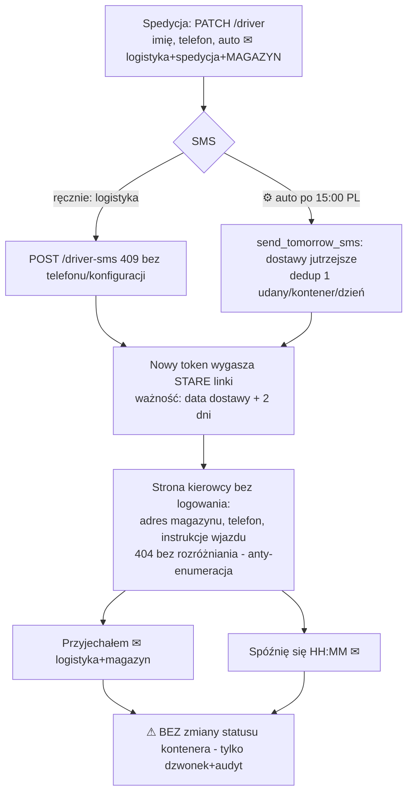
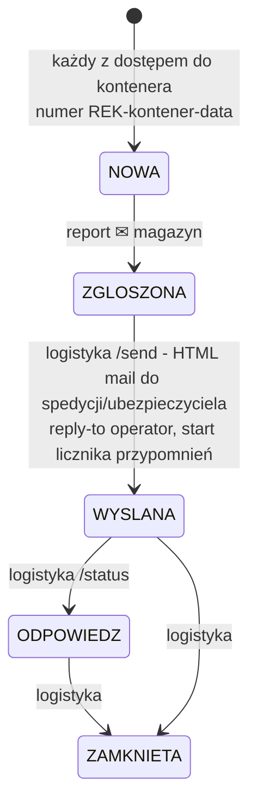
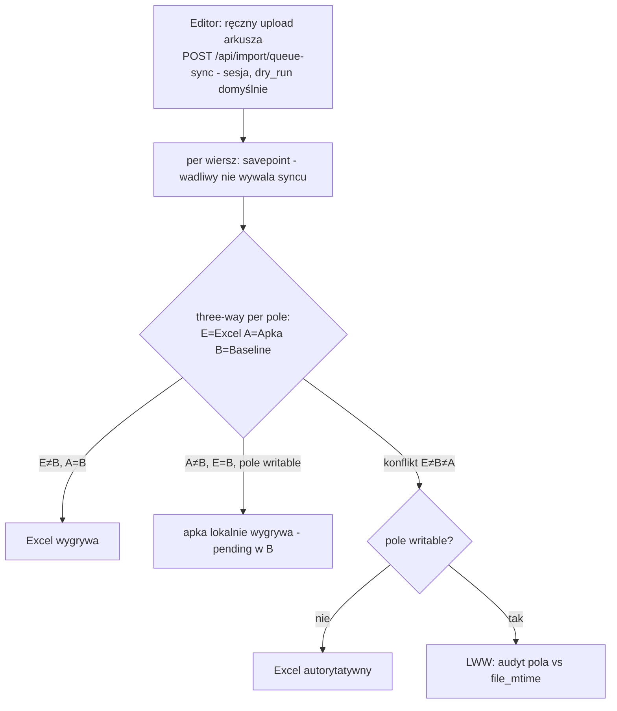

# TIMPORYE — szczegółowa mapa procesów, bramek i decyzji

Stan: 2026-09-03, wyprowadzone **z kodu**; przegląd 2026-09-28 (audyt DOC-004): usunięte automaty
zewnętrznego trackingu kontenerów (provider usunięty — `tracking/service.py`), odnośniki `plik:linia`
zamienione na nazwy plików/funkcji (numery linii się dezaktualizowały). Od 2026-09-03 część logiki
przeniesiono do modułów siostrzanych (`routers/containers_*.py`, pakiet `models/`) — szukaj po nazwie funkcji.
Trzy warstwy: **[U]** user journey (dla użytkowników) → **[P]** procesy z bramkami → **[D]** kontrakty deweloperskie.
Legenda diagramów: prostokąt = krok, romb = bramka decyzyjna, `⚙` = automat/scheduler, `✉` = powiadomienie, `🔒` = ograniczenie roli.

---

## [U] 0. Aktorzy i ich podróże (jedno spojrzenie)

---

## [P] 1. Cykl życia kontenera (status główny)

**Bramki i fakty (⚠ = świadome ryzyko do decyzji):**

| Bramka | Reguła | Źródło |
|---|---|---|
| ⚠ **Brak maszyny stanów** | ręczny `POST /containers/{id}/status` pozwala na DOWOLNY ruch (także wstecz); jedyne wymuszenie: magazyn 🔒 tylko →DOSTARCZONY/ZREALIZOWANY (403); automatu trackingu już nie ma | `containers.py` |
| ISO 6346 | blokująca (422) przy create i PATCH; ⚠ wyjątek: kontenery ze „zlecenia" (`found_order`) powstają z pustym numerem — walidacja dopiero przy PATCH | `iso6346.py`, `containers.py` |
| FK spółki | supplier/warehouse/order muszą należeć do spółki kontenera (404) | `containers.py` |
| ZREALIZOWANY | ustawia `completed_at`; wyjście z FINISHED je czyści | `containers.py` |
| Wyjście z trackowalnych | status ∉ {ZAPOWIEDZIANY, W_TRANSPORCIE, W_PORCIE} → `tracking_error=""` | `containers.py` |
| Audyt | każda zmiana pola: kto/kiedy/stara/nowa (`record`/`record_changes`) | — |

**⚙ Automaty na kontenerze:**
- ~~Auto-status z trackingu~~ — usunięty razem z zewnętrznym providerem; AIS daje tylko pozycje statków i alerty.
- **Opóźniony** (liczone w locie, UTC): FINISHED→nie; `eta<dziś` przy ZAPOWIEDZIANY/W_TRANSPORCIE→tak; `notify_date<dziś` (niezakończony)→tak (`models/`).
- **Demurrage**: termin = pierwsze nie-estymowane DISCHARGE/ARRIVE (fallback ETA) + `demurrage_free_days`; alert gdy zostało ≤3 dni (`DEMURRAGE_ALERT_DAYS`), dedup 1/dzień (`notifications.py`).

---

## [P] 2. Cykl planowania dostawy (data ↔ spedycja)

> Uwaga (2026-09-28): `apply_eta` nie ma dziś wywołań w kodzie aplikacji (tylko testy) — automat przesuwania
> daty z ETA był zasilany przez usunięty tracking. TODO: właściciel — usunąć albo podpiąć pod zmianę ETA.

**Kontrakty [D]:** `apply_eta` `planning.py` (`PLAN_LEAD_DAYS=4`, bramka `planning.py`) • `send_to_forwarder` `planning.py` • `confirm_plan` `planning.py` (bramka data<dziś→422; inna data→`notify_date_manual=True`) • `reset_plan` `planning.py` — **odpala się z WYSLANE i POTWIERDZONE** (`reset_needed = status != PROPOZYCJA`, `containers.py`) • alert przesunięcia ETA po wysyłce: `eta_shift_days` `planning.py`.

---

## [P] 3. Awizacje, limity, kalendarz

[D]: limity `containers.py` • święta PL/PT liczone od Wielkanocy `holidays.py` • kraj z `warehouse.country` (default PL) `containers.py`.

**Wysyłka awizacji (✉ e-mail z formularzem):** `POST /api/avizo/send` (Editors) — grupuje po (spedytor, spółka), osobny token per spółka; token 14 dni, w bazie tylko SHA-256; commit przed mailem; braki (`no_forwarder`, `missing_email`, `failed`) raportowane bez przerywania (`avizo.py`). Formularz publiczny: GET 404/410, prefill **bez** `driver_id_no` (PII); POST potwierdza pozycje (`confirm_plan`) + zapisuje niepuste dane kierowcy; ✉ do logistyki tylko przy pierwszym potwierdzeniu (`avizo.py`).

---

## [P] 4. Zlecenie transportowe (spedycja) — ORDER_FLOW

[D]: przejścia deklaratywne `ORDER_FLOW` `forwarding.py`; egzekwowanie: 422 zły target, 403 zła rola, 409 zły stan bieżący (`forwarding.py`). Kierunek ✉ wg roli aktora. Magazyn **nie widzi** zleceń (`scope_transport_orders` → `false()`, `deps.py`).

---

## [P] 5. RFQ / Wyceny (TransportJob + Quote)

**Izolacja 🔒:** spedycja widzi tylko joby, do których jest zaproszona (WYSLANE/ZLECONE) i **wyłącznie własną ofertę** — nigdy cen konkurencji/SCFI/KPI (`quotes.py`). Rola `purchasing` **wykluczona z całych Wycen** (deny-lista `ViewerNoPurchasing`, `deps.py`). Zmiana ceny po złożeniu = osobny obieg zgłoszenie→akceptacja logistyki (`quotes.py`).

---

## [P] 6. Obieg celny + dokumenty

**Bramki:** zmiana agencji kasuje dane agenta + stara agencja natychmiast traci widoczność (FK), ✉ „odpięto" (`customs.py`). Agent (imię/tel/mail) wyznacza agencja ✉ do nas (`customs.py`). ⚠ ręczna zmiana statusu odprawy — **dowolny→dowolny** dla obu stron (`customs.py`). Alert „odprawa się przeciąga": ZLECONA/REWIZJA ≥3 dni od przypisania, dedup 1/dzień, ✉ obie strony (`notifications.py`).

**Dokumenty (`document_status`):** `BRAK →(pierwszy otypowany załącznik)→ ZALACZONE →(send-docs)→ WYSLANE`.
Bramki wysyłki do agencji: wymaga agencji + ≥1 pliku (409); braki checklisty wymaganych typów → 409, chyba że `force=True` (decyzja w audycie) (`customs.py`). Upload: 🔒 magazyn nie może (403); rozszerzenia z listy, limit `MAX_UPLOAD_MB`=25 egzekwowany strumieniowo (413); losowa nazwa na dysku (`forwarding.py`).

---

## [P] 7. Kierowca (bez konta — token SMS)

[D]: `driver.py`, sms.py (SMSAPI.pl / mock / off).

---

## [P] 8. Reklamacje

Zdjęcia: walidacja po **sygnaturze bajtowej** (nie Content-Type), zapis na dysk po commicie DB (`complaints.py`). ⚙ Przypomnienia: progi `reminder_days` (15,30) od `sent_at`, każdy próg raz (idempotentny commit przed wysyłką), ✉ logistyka+autor (`complaints.py`).

---

## [P] 9. Tranzyty i zakupy (delty od głównego toru)

**Tranzyt (`is_transit`):** ten sam cykl statusów, ale: nie liczy się do limitu dziennego; dane klienta docelowego (`customer_name/address/contact`) wpisywane ręcznie i **maskowane** dla magazynu i agencji (też w historii audytu); DOSTARCZONY potwierdza logistyka (magazynu brak w pętli).

**Zakupy (`purchasing_status`):** `BRAK / DO_ZAMOWIENIA / ZAMOWIONE / POTWIERDZONE / ZREALIZOWANE / WSTRZYMANE` — zmienia rola purchasing/logistyka/admin, ⚠ bez grafu przejść (dowolny→dowolny), audyt + ✉ logistyka (`purchasing.py`). Purchasing dodatkowo: wysyłka dokumentów do agencji (`docs_senders`), reszta pól kontenera poza zasięgiem.

---

## [P] 10. Sync Excel kolejki — ręczny upload, three-way merge

> **Zmiana 2026-09-11:** zrezygnowano z automatyzacji n8n/OneDrive. Nie ma już
> agenta 24h, tokenu serwisowego ani zapisu zwrotnego do Excela (`/sync`,
> `/sync/pending`, `/sync/applied` i katalog `agent/` usunięte). Kolejka
> aktualizuje się **ręcznym uploadem** arkusza przez zalogowanego usera (Editors).
> Skutek uboczny: kasowanie kolejki (admin) jest teraz **trwałym** resetem — nic
> nie odtwarza kontenerów z arkusza.

[D]: imports.py — `queue_sync` (dry_run cofany savepointem) + `reconcile_queue`/`_process_row`.
WRITABLE_FIELDS (12 pól: eta, notify_date, vessel, order_numbers, delivery_note, purchase_note,
document_flow, incoming_delivery_no, rf_number, sent_required, sent_number, sent_status) — pola,
w których edycja w apce wygrywa przy konflikcie (LWW). Zapis zwrotny app→Excel już nie istnieje;
„pending" oznacza tylko, że Excel starszy od edycji nie nadpisze świeżej zmiany.

**Import nowych kontenerów:** `POST /api/import/containers` (dry_run domyślnie) — podgląd
new/exists/invalid/duplicate; zapis tylko `new`; wiersze-separatory pomijane **cicho**, złe ISO
głośno w preview.

**Import zamówień zakupowych (ETD):** `POST /api/import/purchase-orders` — arkusz ETD
(Order No./PI/CBM/typ kontenera...), byt `PurchaseOrder`, upsert po (spółka, order_no),
auto-link do kontenera po order_no. Wcześniejszy etap niż kontener (nie ma jeszcze numeru).

---

## [P] 11. Automaty i schedulery

Aktualna tabela pętli tła (11 zadań + opcjonalne SharePoint i AIS/kongestia): `docs/ARCHITEKTURA.md` §10,
źródło `backend/app/jobs.py` (`build_jobs`). Zewnętrznego providera trackingu (auto-ETA, auto-status) nie ma.

~~Zdarzenia ✉ DEPART/ARRIVE/DISCHARGE/GATE_OUT → `container_watchers` (`tracking/notify.py`)~~ — historyczne: moduł usunięty razem z providerem trackingu. Obserwujący kontener (`routers/watchers.py`) dostają dziś powiadomienia z alertów w `notifications.py` / `notification_alerts.py`.

---

## [D] 12. Macierz ról (kto co widzi i może)

| Rola | Widzi (scope) | Maskowanie | Może zmieniać | Fail-closed |
|---|---|---|---|---|
| admin | wszystko | — | wszystko + słowniki/ustawienia | — |
| logistics | spółka (view_all→wszystko) | — | kontener, status, plany, awizacje, zlecenia, odprawa (assign), reklamacje send/status, SMS | bez spółki→403 |
| purchasing | spółka (odczyt) | — | TYLKO purchasing_status + send-docs; 🔒 wykluczony z Wycen | 403 na Wycenach |
| warehouse | tylko swój magazyn | dostawca, zamówienia, spedytor, notatki, PII kierowcy, klient tranzytu | status→DOSTARCZONY/ZREALIZOWANY; ⚠ nie może uploadować plików; zleceń transportowych **nie widzi wcale** | bez magazynu→403 |
| forwarder | tylko kontenery jemu zlecone | (swoje widzi) | zlecenie (accept/reject/real/done), wycena własna, dane kierowcy, potwierdzenie planu, pliki/wiadomości | bez forwarder_id→403 |
| customs | tylko zlecone odprawy | dane handlowe + całe PII kierowcy + klient tranzytu | agent, statusy odprawy, wiadomości/pliki | bez agencji→403 |
| sales | odczyt kolejki/kalendarza/śledzenia/Specjalnej troski (dodana 2026-09-27) | koszty ukryte, brak Wycen | nic (tylko odczyt) | poza `READER_ROLES` — dostęp tylko tam, gdzie jawnie `ViewerOrSales`/`CareReaders` |

Cudzy zasób = **404** (nie zdradzamy istnienia); brak przypisania = **403**; nieznany kształt zasobu w `_enforce_scope` = 403 (`deps.py`). Maskowanie obejmuje też **historię audytu** (`containers.py`). Nowa rola NIE dziedziczy dostępu po cichu (jawne listy + test-strażnik).

## [D] 13. Auth i wejścia publiczne

- Login: rate-limit 5/15min **per IP**, bcrypt + dummy-verify (anty-enumeracja); JWT access 60 min + refresh 14 dni z **rotacją i reuse-detection** (ponowne użycie odwołanego → ubita cała rodzina + `session_version++`); logout = wylogowanie ze wszystkich urządzeń (security.py, auth.py).
- Publiczne (bez logowania): formularz awizacji `/api/avizo/{token}` (SHA-256, 14 dni, 404/410), strona kierowcy `/api/driver/{token}` (404 bez rozróżniania), `/api/health`. Reszta za rolami + rate-limit 300/min/IP + CSP.
- Produkcja fail-fast: nie wstanie ze słabym SECRET_KEY / domyślnymi hasłami / bez PUBLIC_BASE_URL (`main.py`).

---

## ⚠ 14. Rejestr świadomych ryzyk / luk (do decyzji — audyt mapy)

1. **Status główny bez maszyny stanów** — logistyka może przestawić dowolnie (też wstecz). Świadome? Czy dołożyć graf dozwolonych przejść jak `ORDER_FLOW`?
2. **Status odprawy bez maszyny stanów** — obie strony dowolnie (`customs.py`).
3. **`purchasing_status` bez grafu przejść.**
4. **Kontener ze „zlecenia" z pustym numerem** omija walidację ISO do czasu PATCH.
5. **Przekroczenie limitu dziennego = tylko ostrzeżenie** (zapis przechodzi) — zgodne z decyzją, ale bez śladu „kto zignorował".
6. **Sync: agent pisze zwrotnie bezwarunkowo** — brak feature-flagi Fazy B; docstring agenta nieaktualny.
7. **Zdarzenia kierowcy nie zmieniają statusu** — „przyjechał" to tylko dzwonek; magazyn i tak klika DOSTARCZONY ręcznie (świadome?).
8. `_status_label` w customs.py nie mapuje DRAFT_* — tytuły powiadomień z surowym enumem (kosmetyka).

---
*Źródła: routers/containers.py, planning.py, avizo.py, forwarding.py, quotes.py, customs.py, driver.py, complaints.py, purchasing.py, imports.py, tracking/(service|ais|congestion).py, notifications.py, deps.py, security.py, models.py, holidays.py, main.py — zweryfikowane 2026-09-03 (sekcja 10 zaktualizowana 2026-09-11: n8n usunięty, ręczny queue-sync; przegląd 2026-09-28: bez automatów trackingu, odnośniki bez numerów linii).*
