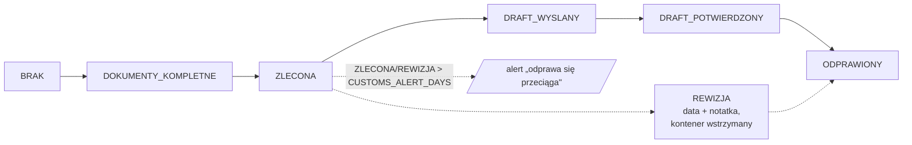
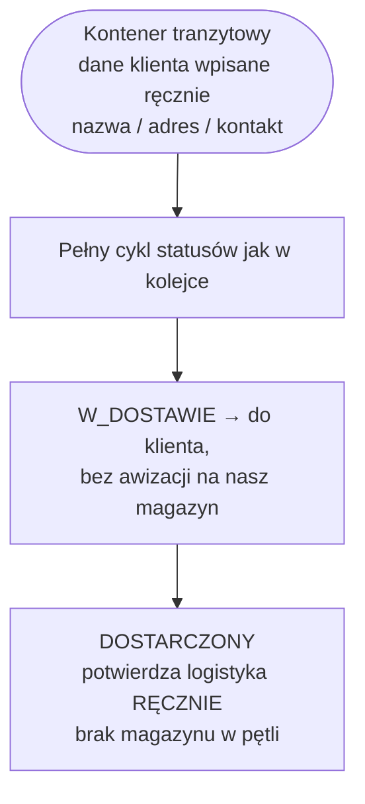
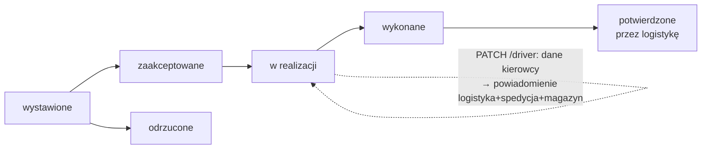
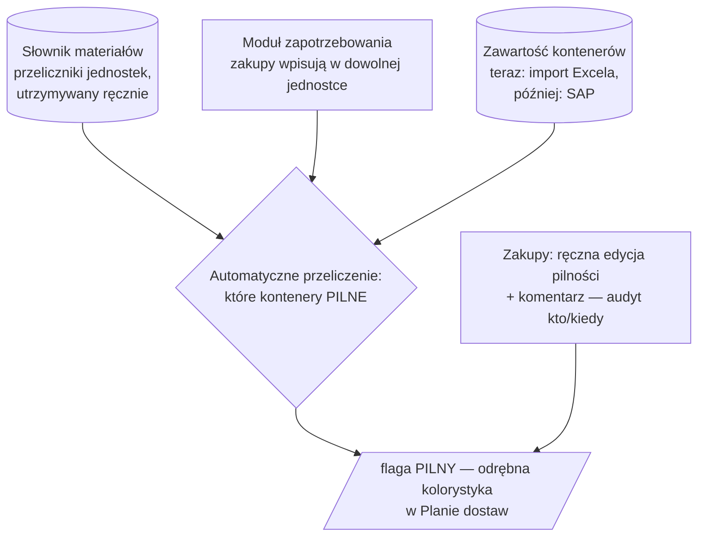

# TIMPORYE — mapa procesu całej aplikacji

Stan: 2026-09-02. Obejmuje system obecny **+ zakres gałęzi `feat/tranzyty-wyszukiwarka-mapa`**
(tranzyty, wyszukiwarka globalna, mapa) **+ domknięte decyzje Etapu 7** (faktury, zakupy, pilność, RF).
Elementy nowe/w budowie oznaczone `🆕`.

---

## 1. Aktorzy

| Rola | Kto | Zakres |
|---|---|---|
| `admin` | administrator | wszystko + panel admina |
| `logistics` | logistyka spółki | kontenery swojej spółki (`view_all_companies` = wszystkie) |
| `purchasing` 🆕 | zakupy | odczyt kontenerów spółki + edycja pilności (audyt) + komentarze + moduł zapotrzebowania |
| `warehouse` | magazyn (np. DLT) | kontenery swojego magazynu; dane handlowe ukryte |
| `forwarder` | spedycja (SPEDALFA, SPEDBETA, Delta Brokers) | tylko kontenery jej zlecone (w tym tranzyty 🆕) |
| `customs` | agencja celna | tylko zlecone odprawy; dane handlowe/PII ukryte |

Egzekwowanie centralne, fail-closed: `deps.py` (`scope_containers` / `check_container_access` — cut-vertex).
**Wyszukiwarka globalna 🆕 i mapa 🆕 przechodzą przez ten sam scoping.**

---

## 2. Główny cykl kontenera (do magazynu)

```mermaid
flowchart TD
    subgraph WEJSCIE[Wejście danych]
        XL[Import Excela<br/>kolejka + zawartość kontenerów 🆕] --> C0
        MAN[Ręczne dodanie<br/>logistyka] --> C0
        FV[Faktura 🆕<br/>M:N faktura↔kontener,<br/>weryfikacja pozycji i nr dostawy] -.niezgodność = komunikat.-> C0
    end

    C0([Kontener<br/>walidacja ISO 6346 — blokująca])

    C0 --> S1[ZAPOWIEDZIANY]
    S1 -->|ręcznie| S2[W_TRANSPORCIE]
    S2 -->|ręcznie (AIS podpowiada)| S3[W_PORCIE]
    S3 --> S4[ODPRAWA]
    S4 --> S5[AWIZOWANY]
    S5 --> S6[W_DOSTAWIE]
    S6 --> S7[DOSTARCZONY]
    S7 --> S8[ZREALIZOWANY → archiwum]

    S5 -.awizacja na datę,<br/>limit dzienny per magazyn,<br/>kalendarz dni wolnych PL/PT.-> AW[Awizacja]
    AW -.potwierdzenie daty:<br/>portal spedycji / formularz publiczny.-> S5
    S7 -.tylko magazyn może ustawić<br/>DOSTARCZONY / ZREALIZOWANY.-> S8

    S2 -.minęło ETA bez przybycia.-> OP[/flaga OPÓŹNIONY/]
    S5 -.minęła awizacja bez dostawy.-> OP
    S3 -.ETA + dni wolne.-> DEM[/alert DEMURRAGE/]
```

Każda zmiana pola → **audyt** (kto, kiedy, stara/nowa wartość). Statusy dokumentów równolegle:
`document_status: BRAK → ZALACZONE → WYSLANE`.

---

## 3. Równoległy tor odprawy celnej



Obieg dwustronny logistyka ↔ agencja: zlecenie → agencja wyznacza agenta → aktualizuje status →
powiadomienia obu stron; zmiana agencji odpina starą (traci dostęp).

---

## 4. Tranzyt 🆕 (osobny moduł — kontener bezpośrednio do klienta)



Widoczność: `logistics`, `admin`, `purchasing` 🆕; spedycja dostaje zlecenia transportowe na tranzyty
tak samo jak na zwykłe kontenery.

---

## 5. Obieg zlecenia transportowego (spedycja)



Przy kontenerze: pliki (CMR, kwity; `UPLOADS_DIR`, limit `MAX_UPLOAD_MB`), wiadomości, wskazanie
agenta celnego. RFQ/wyceny: `TransportJob + Quote + QuoteRevision`.

---

## 6. Zakupy i pilność 🆕



---

## 7. Rezerwacja frachtu (RF) 🆕

Logistyka zakłada RF z pulą → każdy kontener przypisany do `rf_number` zmniejsza **saldo** →
system pokazuje pozostałe i ostrzega przy przekroczeniu. Bez stornowania/korekt księgowych.

---

## 8. Przekrojowe 🆕

- **Wyszukiwarka globalna** — jedno pole w nagłówku; przeszukuje kontenery, zlecenia, faktury,
  wiadomości, pliki; fragment numeru; wyniki grupowane po typie; **zawsze przez scoping ról**.
- **Mapa (Google Maps, klucz API w env)** — (a) osobna strona: wszystkie kontenery spółki,
  pozycje statków z AIS; (b) zakładka w szczegółach kontenera: trasa do magazynu/klienta.
- **Powiadomienia**: in-app / e-mail / Teams; **eksport xlsx**; raport kontenery/miesiąc; panel PL/EN/PT.

---

## 9. Luki do audytu (⚠ z tej rozmowy i dokumentacji)

1. ⚠ `warehouse` z `view_all_companies=True` — błędna konfiguracja dziś dopuszczana.
2. ⚠ Nowa rola `purchasing` — test-strażnik w `deps.py` wymusi zadeklarowanie zachowania (widoczność tranzytów, maskowanie).
3. ⚠ Tranzyt: kto widzi dane klienta docelowego? (spedycja musi — wozi; agencja celna raczej nie).
4. ⚠ Faktura M:N ↔ kontener: reguła „kiedy niezgodność blokuje, a kiedy tylko ostrzega" — niedoprecyzowana.
5. ⚠ Automat pilności zależy od kompletności słownika materiałów (ręczny) — brak przelicznika = kontener niepoliczalny; potrzebny widok braków.
6. ⚠ RF saldo przy tranzytach i przy usunięciu kontenera — zwrot do puli?
7. ⚠ Rekomendacje celne wciąż otwarte: checklista dokumentów, SLA, retencja PII kierowcy.
